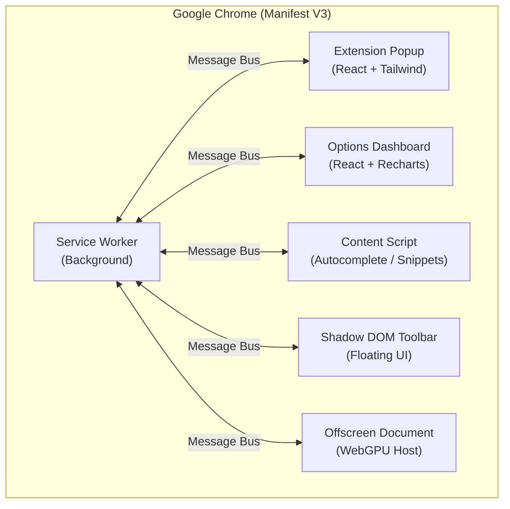
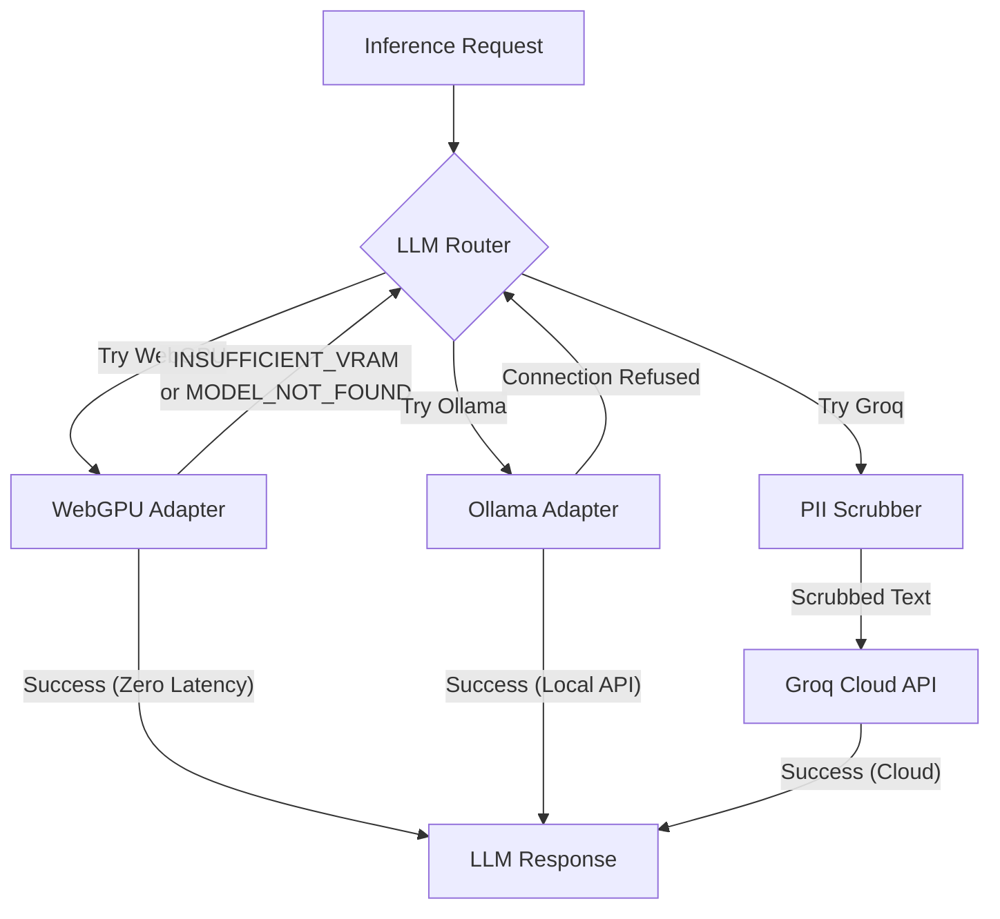
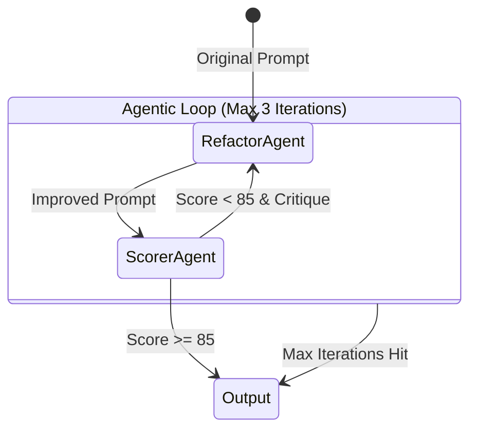
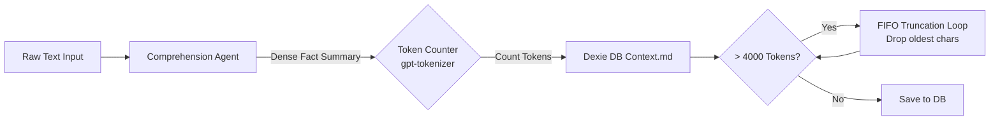
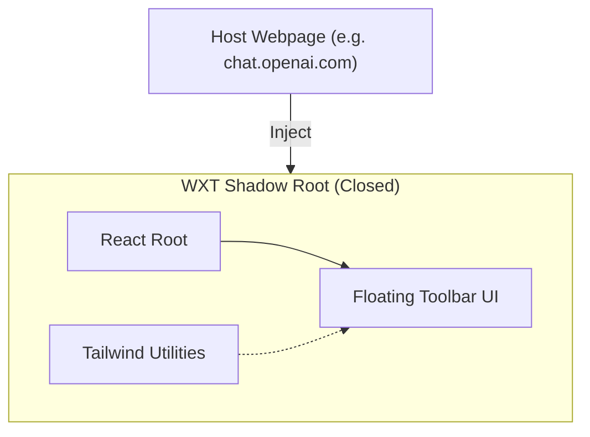
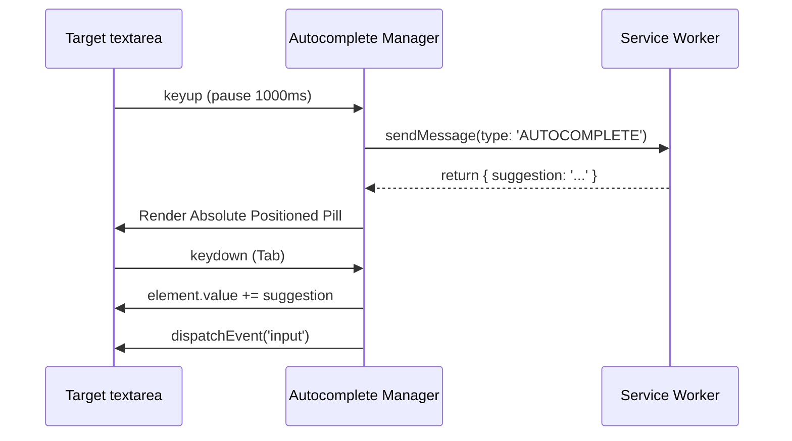

# Pro Prompt Engine — System Architecture

This document details the architectural design of the **Pro Prompt Engine** (Manifest V3 Chrome Extension). The system is built with a heavy emphasis on zero-latency Edge deployment via WebGPU, persistent client-side data structures using Dexie + LRU caching, and an automated agentic framework.

---

## 1. Top-Level Extension Architecture

The Pro Prompt Engine is divided into five isolated environments under WXT. They communicate strictly over the `chrome.runtime` message bus.



---

## 2. LLM Inference Routing Engine

At the core of the engine is the robust Fallback Router. It attempts local GPU inferencing first, falling back to Ollama, and finally hitting the Groq Cloud if hardware constraints fail.



---

## 3. WebGPU Bidirectional Keep-Alive System

Manifest V3 forcibly terminates service workers after 30 seconds of inactivity. To prevent the WebGPU `engine` from being dropped from VRAM, we implemented a bidirectional heartbeat. **This system is only active when WebGPU is the selected provider** — pinging for Groq or Ollama serves no purpose.

> **Note:** The offscreen document (`entrypoints/offscreen/`) is a WXT entrypoint, not a raw HTML file. This is critical because it imports `@mlc-ai/web-llm` which uses bare module specifiers that browsers cannot resolve without a bundler. WXT/Vite bundles the TypeScript entrypoint into a working `offscreen.html` with resolved imports.

```mermaid
sequenceDiagram
    participant SW as Service Worker
    participant Alarm as Chrome Alarms
    participant CS as Content Script
    participant Off as Offscreen (WebLLM)

    Note over SW, Off: 20-second Keep-Alive Cycle (WebGPU only)
    
    CS->>CS: Check activeProvider === 'webgpu'
    
    Alarm->>SW: Tick (Wake-up)
    SW->>SW: Check activeProvider === 'webgpu'
    SW->>Off: ensureOffscreen() / ping
    
    loop Every 20s (only when activeProvider === 'webgpu')
        CS->>SW: KEEP_ALIVE_PING
        SW-->>CS: KEEP_ALIVE_PONG
        
        Off->>Off: GPU No-op Matrix Tick (Buffer Map)
    end
```

---

## 4. Multi-Agent Refactor Loop

The Pro Prompt Engine uses an automated Multi-Agent system to autonomously iteratively improve the user's prompt until it passes a deterministic quality threshold (Score >= 85).



---

## 5. Token-Enforced Context Pruning

The Cache Manager enforces an absolute 4000-token limit on `Context.md` to prevent context-window overflow during API requests. It uses `gpt-tokenizer` to accurately track tokens.



---

## 6. Hybrid Data Layer (IndexedDB + LRU Cache)

To achieve sub-millisecond data retrieval synchronous with React renders, we back the `Dexie` IndexedDB store with an O(1) in-memory LRU Cache Map.

```mermaid
graph TD
    App[React Components] -->|Read Request| LRU{LRU Cache (In-Memory)}
    LRU -- "Hit (O(1))" --> App
    LRU -- "Miss" --> Dexie[(Dexie IndexedDB)]
    Dexie -->|Load into Cache| LRU
    
    App -->|Write Request| CacheMgr[Cache Manager]
    CacheMgr --> LRU
    CacheMgr --> Dexie
```

---

## 7. Shadow DOM UI Injection

To prevent host-site CSS (like Tailwind from ChatGPT or Claude) from bleeding into our extension, the Toolbar UI is injected via a closed Shadow DOM boundaries using WXT's utility.



---

## 8. Snippet & Autocomplete Content Script Flow

The Content Script aggressively listens for DOM mutations to inject ghost-text and snippet popovers over arbitrary text areas in complex React applications.


