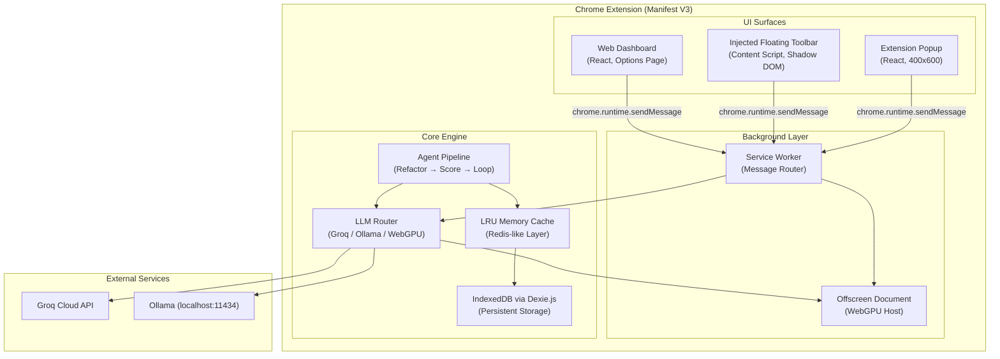
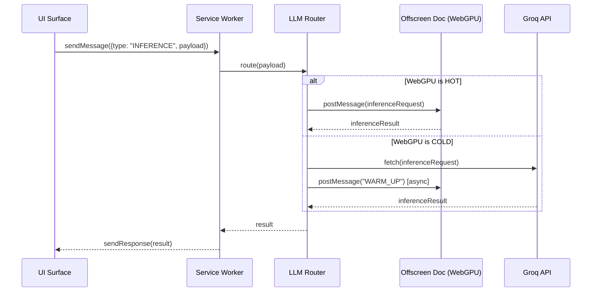
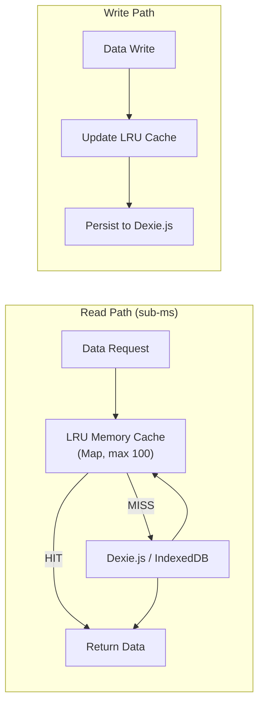
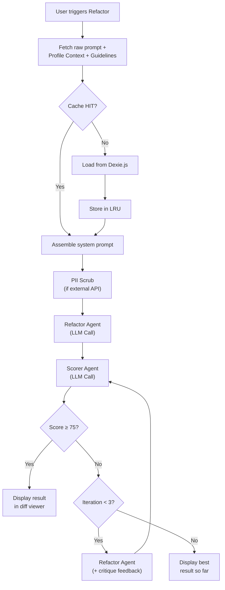

# Pro Prompt Engine — Development Implementation Plan

## Overview

The **Pro Prompt Engine** is a Manifest V3 Chrome Extension that provides a dynamic, agentic prompt engineering environment. It operates across **three UI surfaces** (Extension Popup, Injected Floating Toolbar, Web Dashboard) and supports **hybrid LLM execution** (WebGPU local models, Ollama localhost, Groq cloud API) with a multi-agent refinement loop.

This plan breaks the FRD into **7 granular development phases**, each with clear deliverables, technical specifications, and acceptance criteria.

---

## High-Level Architecture



---

## Technical Decisions & Rationale

| Decision | Choice | Rationale |
|---|---|---|
| **Build Tool** | Vite + CRXJS | CRXJS handles MV3 manifest, HMR, multi-entry points, and content script bundling natively |
| **UI Framework** | React 18 + TypeScript | Required by spec; strong ecosystem for component reuse across 3 surfaces |
| **Styling** | Tailwind CSS v3 | Explicitly required by FRD; design system tokens map directly to Tailwind utilities |
| **Persistent Storage** | Dexie.js (IndexedDB wrapper) | Type-safe, promise-based API; handles schema migrations; avoids raw IndexedDB boilerplate. ~15KB gzipped — negligible bundle impact |
| **In-Memory Cache** | Custom LRU Map | No Redis/Node libs in browser. A `Map`-based LRU (≤200 lines) with write-through to Dexie provides sub-ms reads for hot profile contexts |
| **Agentic Logic** | Custom TS functions | No LangChain/LangGraph — they'd add 500KB+ of polyfills and Node dependencies. Custom `agentLoop()`, `score()`, `refactor()` functions are ~50 lines each |
| **WebGPU Host** | Offscreen Document API | Only way to maintain a persistent DOM context with GPU access in MV3. Service Workers cannot access WebGPU |
| **Content Script Isolation** | Shadow DOM | Prevents host page CSS from leaking into toolbar; Tailwind styles scoped inside shadow root |
| **PII Scrubbing** | Regex-based local filter | Lightweight regex patterns for API keys (`sk-...`, `ghp_...`), emails, IPs run before any external API call |
| **Token Counting** | `gpt-tokenizer` (MIT, 8KB) | Pure JS BPE tokenizer, no WASM dependency; works in all extension contexts |

---

## Phase 1: Foundation & Scaffolding *(Immediate Execution)*

> [!IMPORTANT]
> This phase will be executed immediately after plan approval. All subsequent phases require review before proceeding.

### Deliverables
- WXT + React + TypeScript project scaffold.
- `wxt.config.ts` setup (forcing options page to open in tab, injecting CSS).
- Tailwind CSS with custom design system tokens from `Design.md`
- Complete folder structure per `setup_and_folder_structure.md`
- Manifest V3 with correct permissions, entry points, and host permissions
- Placeholder files for all entry points (`popup.html`, `dashboard.html`, `service-worker.ts`, `content-script.ts`, `offscreen.html`)
- Path aliases (`@/`, `@core/`, `@ui/`)
- Complete file-based routing folder structure (`entrypoints/`)
- Build verification (extension loads in Chrome)

### Folder Structure

```
pro-prompt-engine/
├── public/
│   ├── icons/
│   │   ├── icon-16.png
│   │   ├── icon-48.png
│   │   └── icon-128.png
│   └── offscreen.html
├── src/
│   ├── background/
│   │   ├── service-worker.ts
│   │   ├── llm-router.ts
│   │   └── heartbeat.ts
│   ├── content/
│   │   ├── content-script.ts
│   │   ├── dom-scraper.ts
│   │   └── InjectedToolbar.tsx
│   ├── ui/
│   │   ├── popup/
│   │   │   ├── index.html
│   │   │   ├── main.tsx
│   │   │   └── PopupApp.tsx
│   │   └── dashboard/
│   │       ├── index.html
│   │       ├── main.tsx
│   │       └── DashboardApp.tsx
│   ├── core/
│   │   ├── agents/
│   │   │   ├── refactor-agent.ts
│   │   │   ├── scorer-agent.ts
│   │   │   ├── generator-agent.ts
│   │   │   ├── comprehension-agent.ts
│   │   │   └── agent-loop.ts
│   │   ├── cache/
│   │   │   ├── lru-cache.ts
│   │   │   └── cache-manager.ts
│   │   ├── db/
│   │   │   ├── dexie-db.ts
│   │   │   └── repositories.ts
│   │   ├── types/
│   │   │   ├── profile.types.ts
│   │   │   ├── snippet.types.ts
│   │   │   ├── llm.types.ts
│   │   │   └── message.types.ts
│   │   └── utils/
│   │       ├── debounce.ts
│   │       ├── pii-scrubber.ts
│   │       └── token-counter.ts
│   ├── shared/
│   │   └── components/
│   │       └── .gitkeep
│   └── manifest.json
├── tailwind.config.js
├── postcss.config.js
├── tsconfig.json
├── vite.config.ts
├── package.json
└── README.md
```

### Dependencies

```json
{
  "dependencies": {
    "react": "^18.3.x",
    "react-dom": "^18.3.x",
    "dexie": "^4.x",
    "dexie-react-hooks": "^1.x"
  },
  "devDependencies": {
    "@crxjs/vite-plugin": "^2.0.0-beta.x",
    "@vitejs/plugin-react": "^4.x",
    "@types/chrome": "^0.0.x",
    "@types/react": "^18.x",
    "@types/react-dom": "^18.x",
    "autoprefixer": "^10.x",
    "postcss": "^8.x",
    "tailwindcss": "^3.x",
    "typescript": "^5.x",
    "vite": "^5.x"
  }
}
```

---

## Phase 2: LLM Infrastructure & Model Router

### Deliverables
- **LLM Router** (`llm-router.ts`): Unified interface that dispatches inference requests to the active provider
- **Groq Adapter**: REST client for `api.groq.com` with API key management via `chrome.storage.sync`
- **Ollama Adapter**: HTTP client for `localhost:11434` with connection health checking
- **WebGPU Adapter**: Message-passing bridge to the Offscreen Document
- **Offscreen Document**: Full implementation with WebGPU model loading, heartbeat keep-alive (`chrome.alarms` every 25s), and model state reporting
- **Hybrid Fallback Logic**: If WebGPU context is cold → route to Groq instantly + trigger async warm-up
- **Model Selection State**: Shared state via `chrome.storage.local` for active model across all surfaces



### Technical Notes
- The Offscreen Document uses `chrome.offscreen.createDocument({ reasons: ['WORKERS'], justification: 'WebGPU inference' })`
- Heartbeat uses `chrome.alarms.create('webgpu-heartbeat', { periodInMinutes: 0.4 })` (~24 seconds) to keep the service worker alive
- The offscreen document maintains a `setInterval` with a no-op WebGPU operation to prevent VRAM eviction

---

## Phase 3: Data Layer — Cache, Storage & Profiles

### Deliverables
- **Dexie.js Schema**: Tables for `profiles`, `snippets`, `promptHistory`, `settings`, `analytics`
- **LRU Cache** (`lru-cache.ts`): Generic `LRUCache<K, V>` class with configurable `maxSize` (default: 100 entries), `get()`, `set()`, `has()`, `evict()`, write-through to Dexie
- **Cache Manager**: Coordinates the in-memory LRU with Dexie persistence; on startup, pre-heats cache with active profile data
- **Profile Repository**: CRUD operations for profiles with the 3-file system (`Context.md`, `PromptGuidelines.md`, `ProfileDescription.md`) stored as structured fields
- **Snippet Repository**: CRUD for snippets with prefix-trigger indexing
- **Default Profiles**: Pre-seed 6 profiles (All-Rounder, Finance, Study, Developer, Competitive Coder, Creativity) with baseline `PromptGuidelines.md` and `ProfileDescription.md`
- **Token Counter Utility**: Uses `gpt-tokenizer` to enforce a 4000-token cap on `Context.md` with FIFO pruning



### Dexie Schema (v1)

```typescript
class ProPromptDB extends Dexie {
  profiles!: Table<Profile>;
  snippets!: Table<Snippet>;
  promptHistory!: Table<PromptHistoryEntry>;
  settings!: Table<Setting>;
  analytics!: Table<AnalyticsEvent>;

  constructor() {
    super('ProPromptEngine');
    this.version(1).stores({
      profiles: '++id, name, isActive, createdAt',
      snippets: '++id, prefix, profileId, createdAt',
      promptHistory: '++id, profileId, score, createdAt',
      settings: 'key',
      analytics: '++id, event, timestamp'
    });
  }
}
```

---

## Phase 4: UI Surfaces — Popup, Dashboard & Floating Toolbar

### 4A: Extension Popup (400×600px)
- Header with score badge + active model indicator
- Profile selector grid (3×2 circular icons + "+" button)
- Action panel (Refactor + Generate buttons)
- Quick toggles (Autocomplete, Text Select)
- Context & Snippets section (Scan Webpage + Snippet quick-add form)
- All state synced via `chrome.storage` listeners

### 4B: Web Dashboard (Options Page)
- Sidebar navigation: Dashboard, Prompt Library, Analytics, Snippets, Context Hub, Settings
- **Snippets Management**: Data table with prefix, description, body preview, edit/delete actions
- **Context Hub**: Split-pane layout — profile cards (left) + editing pane (right) with `Context.md`, `PromptGuidelines.md`, `ProfileDescription.md` editors
- **Settings & Models**: Grid cards for WebGPU models (Gemma, Llama, Qwen) with download progress bars and "Set Active" buttons
- **Analytics**: Charts for tokens used, avg scores, model usage (via lightweight chart lib like `chart.js` or canvas-based custom)

### 4C: Injected Floating Toolbar (Content Script)
- Vertical pill container with glassmorphism (`rgba(30, 41, 59, 0.8)` + `backdrop-blur`)
- Shadow DOM isolation to prevent CSS conflicts
- 7 icon action buttons with tooltips
- Drag handle (vertical axis only) with opacity-on-drag
- Collapse/expand toggle
- MutationObserver for SPA re-injection (ChatGPT, Claude, Gemini route changes)

### Design System Implementation

The Tailwind config will encode the exact design tokens from `Design.md`:

```javascript
// tailwind.config.js (extended theme)
theme: {
  extend: {
    colors: {
      'app-bg': '#0F172A',
      'surface': '#1E293B',
      'surface-elevated': 'rgba(30, 41, 59, 0.8)',
      'border-default': '#334155',
      'primary': '#2563EB',
      'primary-hover': '#1D4ED8',
      'primary-glow': 'rgba(37, 99, 235, 0.2)',
      'primary-text': '#60A5FA',
      'accent-yellow': '#FBBF24',
      'accent-yellow-bg': 'rgba(251, 191, 36, 0.15)',
      'accent-red': '#EF4444',
      'accent-red-bg': 'rgba(239, 68, 68, 0.15)',
      'accent-green': '#10B981',
      'text-primary': '#F8FAFC',
      'text-secondary': '#94A3B8',
      'text-muted': '#64748B',
    },
    fontFamily: {
      sans: ['Inter', 'Roboto', 'system-ui', 'sans-serif'],
      mono: ['Fira Code', 'JetBrains Mono', 'monospace'],
    },
    borderRadius: {
      'btn': '6px',
      'modal': '12px',
    },
    boxShadow: {
      'modal': '0 25px 50px -12px rgba(0, 0, 0, 0.5)',
    },
    transitionDuration: {
      'ui': '150ms',
    },
  },
}
```

---

## Phase 5: Agentic Logic — Agents, Scoring & Refactoring

### Deliverables
- **Refactor Agent**: System prompt construction from `PromptGuidelines.md` + `Context.md` → structured output request
- **Scorer Agent**: Deterministic scoring prompt → JSON response `{ score: number, critique: string }`
- **Generator Agent**: Description + Profile + Detail Level → full prompt generation
- **Comprehension Agent**: Raw text → formatted, summarized context suitable for `Context.md`
- **Agent Loop Controller** (`agent-loop.ts`): Orchestrates the Draft→Score→Refactor cycle with:
  - Score threshold: **≥75** = accept
  - Max iterations: **3** (circuit breaker)
  - Each iteration passes previous critique to refactor agent
- **PII Scrubber**: Regex pipeline for `sk-*`, `ghp_*`, emails, IPs, AWS keys — runs before external API routing



---

## Phase 6: Content Script Features — Autocomplete, Snippets & Context

### Deliverables
- **Inline Autocomplete** (ghost text):
  - 400ms debounce on keystroke events
  - Grabs last ~150 words preceding cursor
  - Inference params: `max_tokens: 30, temperature: 0.2, stop: [".", "\n"]`
  - DOM overlay with `opacity-50 pointer-events-none` span at cursor coordinates
  - Tab key acceptance handler
  - **AbortController** to cancel stale requests on new keystrokes
  
- **Snippet Trigger** (`@` / `/`):
  - Keydown listener detects trigger characters
  - Floating popover menu positioned at cursor coordinates
  - Real-time IndexedDB query filtering as user types
  - Arrow keys + Enter or mouse click for selection
  - Textarea value slice + body text insertion + cursor repositioning

- **Context Feeding Pipelines**:
  - **Method A (Manual)**: Modal with profile dropdown + text area → Comprehension Agent → append to `Context.md`
  - **Method B (Text Selection)**: `mouseup` listener → tooltip "Feed to Profile" → mini-dropdown → direct append
  - **Method C (Web Scan)**: DOM scraper strips noise → chunk text → Comprehension Agent → dense summary → append with timestamp

- **Context Pruning**: Background job on `chrome.runtime.onStartup` that runs Comprehension Agent to "summarize the summaries" when `Context.md` exceeds 4000 tokens

---

## Phase 7: Polish, Analytics & Production Readiness

### Deliverables
- **Analytics Dashboard**: Charts for total tokens, avg response score, active prompts, model usage
- **Prompt Library**: Saved/finalized prompts categorized by use case with search
- **Profile Export/Import**: JSON blob export of the 3-file profile system
- **Error Handling**: Graceful degradation for all LLM failures, network timeouts, WebGPU crashes
- **Performance Optimization**: Code splitting per entry point, tree-shaking, lazy loading dashboard views
- **Accessibility**: ARIA labels on all interactive elements, keyboard navigation
- **Documentation**: Architecture docs with Mermaid diagrams, API reference for message types

---

## User Review Required

> [!IMPORTANT]
> **Tailwind CSS Version**: The FRD and setup doc specify Tailwind. I will use **Tailwind CSS v3** (stable, widely supported by CRXJS). Tailwind v4 has breaking changes with PostCSS config. Please confirm if v3 is acceptable.

> [!IMPORTANT]
> **Dashboard as Options Page vs. Separate Tab**: The FRD mentions "Next.js Web Dashboard" in one place, but this is a browser extension — I will implement the Dashboard as the Chrome Extension **Options Page** (accessible via `chrome-extension://id/src/ui/dashboard/index.html`), built with React inside the extension bundle. This avoids the complexity and overhead of a separate Next.js server. Please confirm.

> [!WARNING]
> **WebGPU Model Integration**: The actual WebGPU model loading (e.g., using `@anthropic-ai/wllama` or `web-llm`) will be architecturally prepared in Phase 2 with the Offscreen Document scaffold, but the specific model runtime library choice should be finalized when we reach that phase. The scaffold will include the full message-passing infrastructure.

> [!IMPORTANT]
> **CRXJS Beta**: The `@crxjs/vite-plugin` is currently in beta (`2.0.0-beta.x`). It is the most mature solution for Vite + MV3, but may have edge cases. I will pin to the latest stable beta release.

---

## Verification Plan

### Phase 1 Verification (Scaffolding)
- `npm run dev` completes without errors
- Extension loads in `chrome://extensions/` with Developer Mode
- Popup opens when clicking the extension icon
- Dashboard opens via the Options Page link
- Service worker registers and shows "Active" in DevTools
- Content script logs to console on page load
- Tailwind classes compile and render correctly

### Subsequent Phase Verification
- **Phase 2**: Service worker routes messages; Offscreen Document creates/destroys; Groq adapter returns mock response
- **Phase 3**: CRUD operations on profiles/snippets via Dexie; LRU cache hits/misses logged; token counter enforces limits
- **Phase 4**: All 3 UI surfaces render with full design system; responsive layouts; drag/collapse on toolbar
- **Phase 5**: Agent loop completes ≤3 iterations; scores parse correctly; PII scrubber catches test patterns
- **Phase 6**: Ghost text appears on debounce; snippet popover filters; context appends to profile
- **Phase 7**: Analytics charts render; export/import round-trips; no console errors in production build

---

## Open Questions

> [!IMPORTANT]
> 1. **Chart Library for Analytics**: Should I use `chart.js` (~60KB) for the Analytics dashboard, or build lightweight canvas-based charts to minimize bundle size?
> 2. **WebGPU Runtime**: Which WebGPU LLM runtime do you prefer? Options include `@anthropic-ai/wllama`, `web-llm` (MLC), or a custom WebGPU compute pipeline. This can be decided in Phase 2.
> 3. **Profile Sync**: The FRD mentions portability. Should export/import be a Phase 7 feature, or should we prioritize it earlier?
