<div align="center">

# ⚡ Pro Prompt Engine

### *An Agentic, Local-First Prompt Engineering Environment*

[](https://developer.chrome.com/docs/extensions/mv3/)
[](https://developer.chrome.com/docs/extensions/mv3/intro/)
[](https://react.dev/)
[](https://www.typescriptlang.org/)
[](https://wxt.dev/)
[](https://www.w3.org/TR/webgpu/)
[](https://tailwindcss.com/)
[](./LICENSE)

**Refactor, score, and generate production-grade prompts** — powered by on-device AI via WebGPU, with seamless cloud fallback. Works natively inside ChatGPT, Claude, Gemini, and Perplexity.

[Features](#-core-features) · [Architecture](#-system-architecture) · [Getting Started](#-getting-started) · [How It Works](#-how-it-works) · [Tech Stack](#%EF%B8%8F-tech-stack) · [Contributing](#-contributing)

</div>

---

## 🎯 What is Pro Prompt Engine?

Pro Prompt Engine is a **Manifest V3 Chrome Extension** that transforms how you interact with LLMs. Instead of writing prompts from scratch every time, the engine uses a **multi-agent AI pipeline** to autonomously refactor, score, and generate high-quality prompts — all running **locally on your GPU** via WebGPU, with zero data leaving your browser.

> **The problem:** 90% of LLM users write vague, unstructured prompts and get mediocre responses. Writing great prompts is a skill — but it shouldn't have to be.
>
> **Our solution:** An agentic system that watches what you type, understands your persona, and automatically engineers production-grade prompts — with a **Refactor → Score → Iterate** loop running entirely on-device.

### ✨ Key Highlights

- 🧠 **Local-First AI** — WebGPU inference via `@mlc-ai/web-llm`. Your data never leaves the browser.
- 🔄 **Multi-Agent Refactor Loop** — Autonomous Draft → Score → Critique → Refine cycle (up to 3 iterations).
- 🎭 **6 Built-in Personas** — Developer, Finance, Study, Competitive Coder, Creativity, and All-Rounder.
- 💬 **Works Inside AI Platforms** — Injects a floating toolbar directly into ChatGPT, Claude, Gemini, and more.
- 📝 **Snippet System** — `/dev`, `/json`, `/step` — instant prompt injection via trigger prefixes.
- 🔍 **Web Page Scanner** — Feed entire web pages as context to any persona using Mozilla Readability.
- 🔒 **PII Scrubbing** — Auto-strips API keys, emails, IPs before any cloud fallback.
- ⚡ **Sub-ms Data Access** — Hybrid LRU Cache + IndexedDB for instant profile/snippet loading.

---

## 📸 UI Surfaces

Pro Prompt Engine operates across **three interconnected UI surfaces**:

| Surface | Description | Tech |
|---------|-------------|------|
| **Extension Popup** (400×600px) | Quick-access remote control — switch profiles, trigger refactoring, score prompts | React + Tailwind |
| **Floating Toolbar** | Injected into ChatGPT/Claude/Gemini — glassmorphic pill with all actions + modals | Shadow DOM + React |
| **Web Dashboard** | Full options page — manage profiles, snippets, analytics, model downloads | React + Recharts |

---

## 🏗️ System Architecture

### Top-Level Extension Architecture

The extension is divided into **five isolated environments** managed by WXT. They communicate strictly over Chrome's `chrome.runtime` message bus.

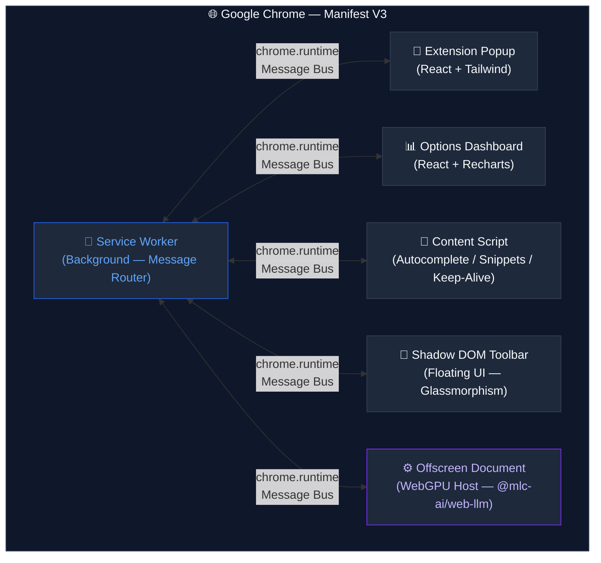

### Full System Data Flow — End-to-End

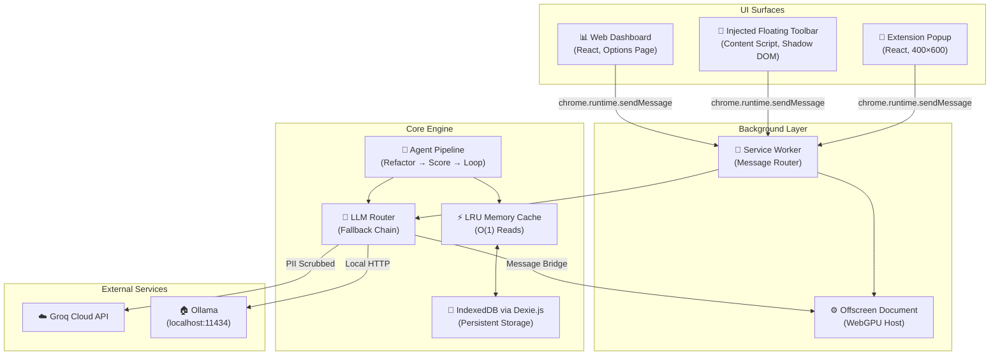

---

## 🔀 LLM Inference Routing Engine

The heart of the system is the **Hybrid Fallback Router**. It attempts providers in priority order: **WebGPU → Ollama → Groq**, automatically falling back on failure.

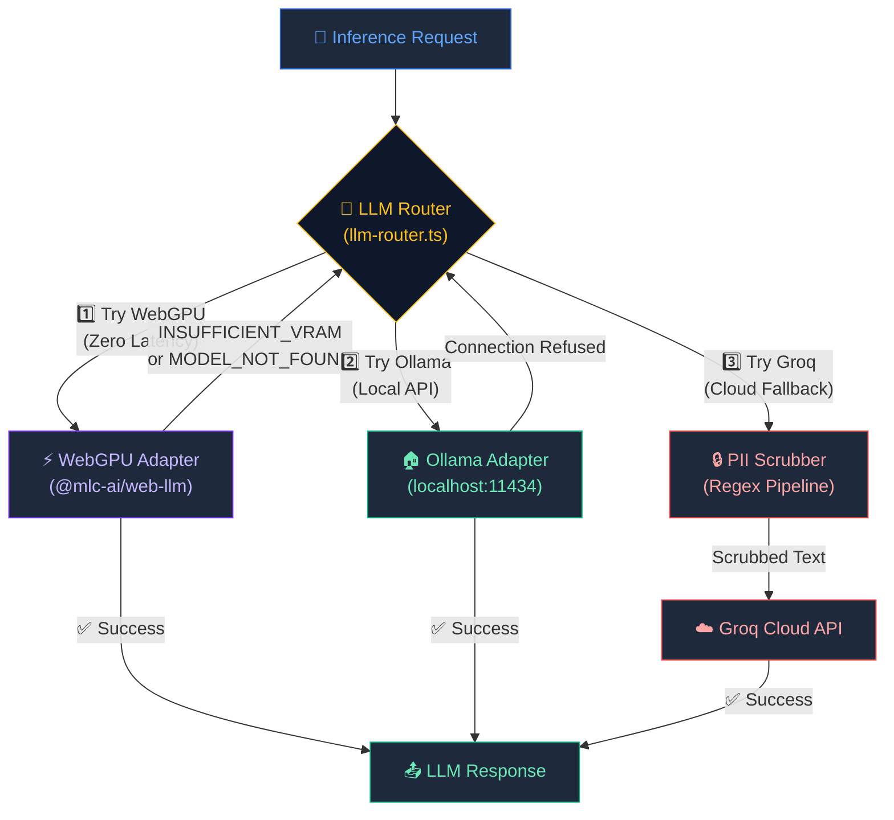

### Provider Comparison

| Provider | Latency | Privacy | Requirements |
|----------|---------|---------|-------------|
| **WebGPU** | ~50-200ms | ✅ 100% Local | WebGPU-capable GPU, model downloaded |
| **Ollama** | ~200-500ms | ✅ Local | Ollama running on `localhost:11434` |
| **Groq** | ~300-800ms | ⚠️ Cloud (PII scrubbed) | API key in Settings |

---

## 🤖 Multi-Agent Refactor Loop

The core intelligence is a **self-correcting multi-agent system** that autonomously iterates on prompt quality until a score threshold of **≥75** is reached (max 3 iterations).

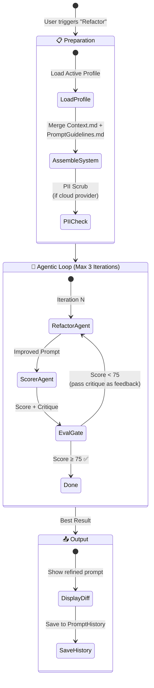

### Agent Pipeline — Detailed Flow

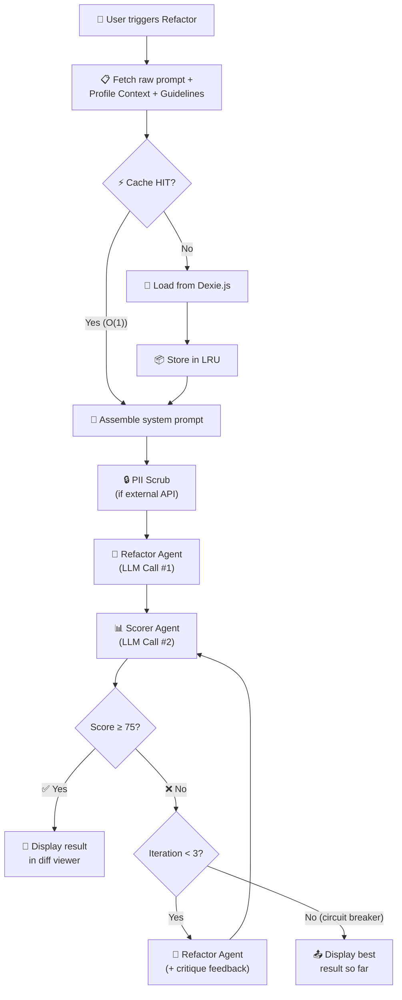

### Individual Agent Specifications

| Agent | Purpose | Temperature | Max Tokens | Input |
|-------|---------|-------------|------------|-------|
| **Refactor Agent** | Restructure prompts for clarity, constraints, and persona | 0.5 | 2000 | Raw prompt + Guidelines + Context + Prior critique |
| **Scorer Agent** | Deterministic quality evaluation (0-100) | 0.3 | 300 | Refactored prompt + ScoringGuidelines.md |
| **Generator Agent** | Create prompts from natural language descriptions | 0.7 | 2000 | Description + Profile + Detail level slider |
| **Comprehension Agent** | Summarize raw text into dense context for Context.md | 0.3 | 1000 | Raw web content / pasted text |

---

## 💾 Hybrid Data Layer

### Read/Write Architecture — LRU Cache + IndexedDB

To achieve **sub-millisecond reads** synchronous with React renders, we back the Dexie IndexedDB store with an **O(1) in-memory LRU Cache Map**.

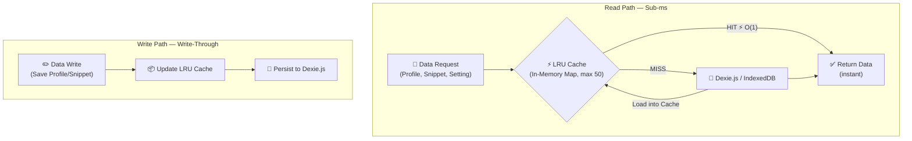

### Database Schema (Dexie.js v1)

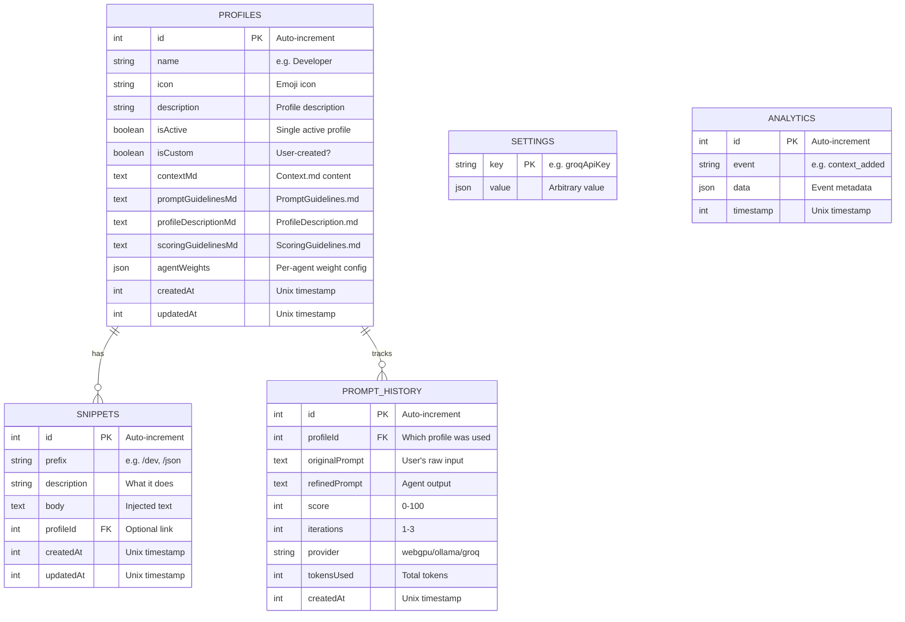

---

## 🔐 WebGPU Keep-Alive System

Manifest V3 forcibly **terminates service workers after 30 seconds** of inactivity. To prevent the WebGPU model from being dropped from VRAM, we implemented a **bidirectional heartbeat** system.

> ⚠️ This system is **only active when WebGPU is the selected provider** — pinging for Groq or Ollama serves no purpose.

```mermaid
sequenceDiagram
    participant CS as 📄 Content Script
    participant SW as 🔧 Service Worker
    participant Alarm as ⏰ Chrome Alarms
    participant Off as ⚙️ Offscreen (WebLLM)

    Note over CS, Off: 🔄 20-second Bidirectional Keep-Alive Cycle (WebGPU only)

    rect rgb(15, 23, 42)
        CS->>CS: Check activeProvider === 'webgpu'

        Alarm->>SW: Tick (Wake-up every ~24s)
        SW->>SW: Check activeProvider === 'webgpu'
        SW->>Off: ensureOffscreen() / ping

        loop Every 20 seconds (only when WebGPU active)
            CS->>SW: KEEP_ALIVE_PING
            SW-->>CS: KEEP_ALIVE_PONG

            Off->>Off: GPU No-op Matrix Tick<br/>(Buffer Map — prevent VRAM eviction)
        end
    end

    Note over CS, Off: If user switches to Groq/Ollama → pings stop automatically
```

---

## 📝 Content Script Features

### Snippet Trigger System (`/` prefix)

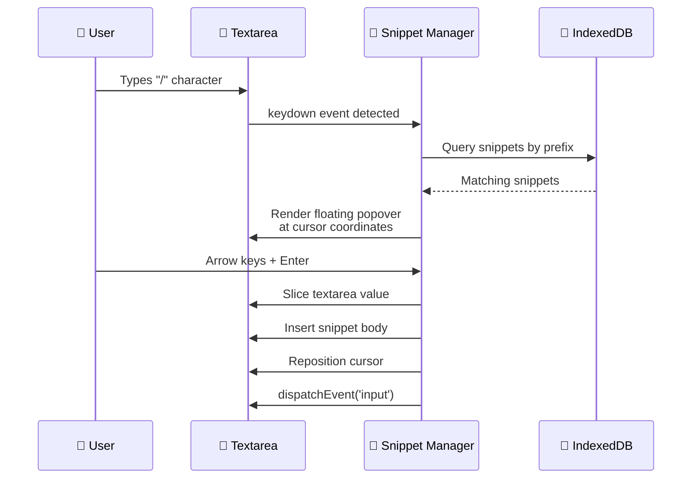

### Inline Autocomplete (Ghost Text)

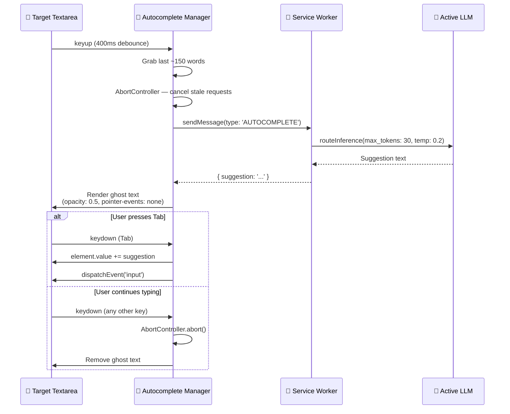

### Context Feeding Pipeline — Three Ingestion Methods

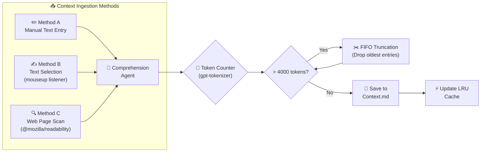

---

## 🎨 Shadow DOM UI Injection

To prevent host-site CSS from bleeding into our extension, the Toolbar UI is injected via a **closed Shadow DOM** boundary using WXT's `createShadowRootUi`.

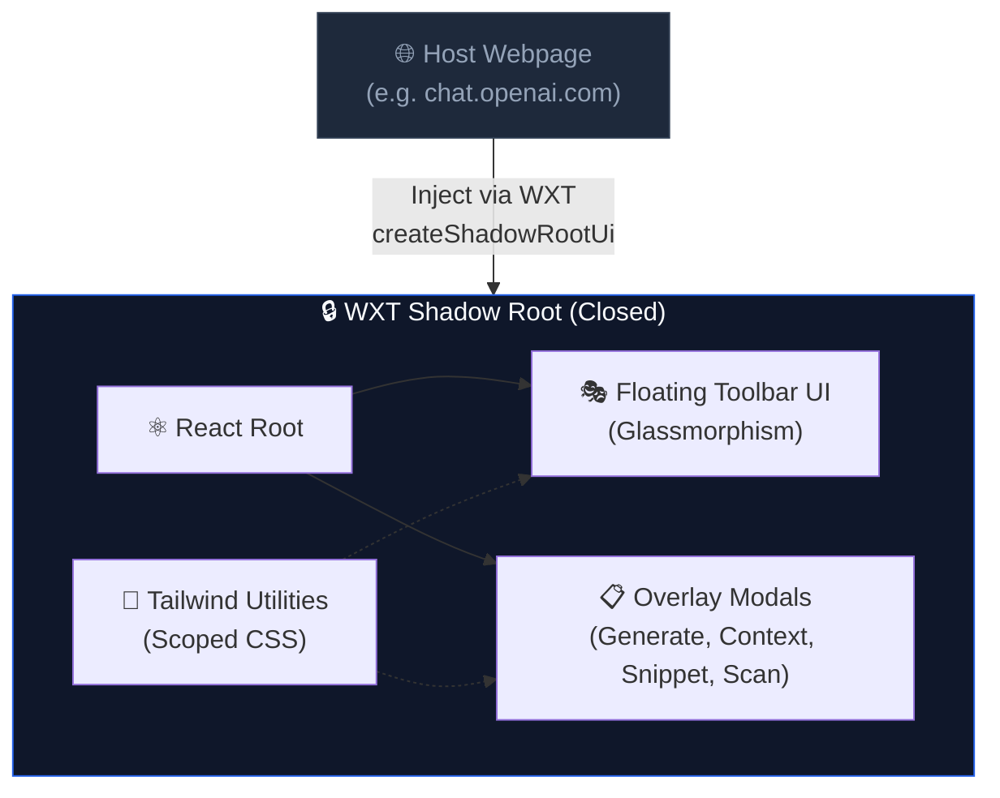

### Target Sites

The toolbar automatically injects on these AI platforms:

| Platform | Domain | Status |
|----------|--------|--------|
| ChatGPT | `chat.openai.com`, `chatgpt.com` | ✅ Supported |
| Claude | `claude.ai` | ✅ Supported |
| Gemini | `gemini.google.com` | ✅ Supported |
| AI Studio | `aistudio.google.com` | ✅ Supported |
| Perplexity | `perplexity.ai` | ✅ Supported |

---

## 📁 Project Structure

```
pro-prompt-engine/
├── 📁 entrypoints/                    # WXT auto-discovered entry points
│   ├── background.ts                  # Service Worker — message router + lifecycle
│   ├── content.ts                     # Content Script — keep-alive + web scanning
│   ├── toolbar.content.tsx            # Floating Toolbar — Shadow DOM React UI
│   ├── 📁 popup/                      # Extension Popup (400×600)
│   │   ├── index.html
│   │   ├── main.tsx
│   │   └── App.tsx                    # Popup React app
│   ├── 📁 options/                    # Web Dashboard (full-page)
│   │   ├── index.html
│   │   ├── main.tsx
│   │   └── App.tsx                    # Dashboard React app
│   └── 📁 offscreen/                  # WebGPU Host (hidden)
│       ├── index.html
│       └── main.ts                    # WebLLM engine manager
│
├── 📁 lib/                            # Shared business logic
│   ├── 📁 adapters/                   # LLM provider adapters
│   │   ├── llm-router.ts             # Hybrid fallback chain
│   │   ├── groq-adapter.ts           # Groq Cloud REST client
│   │   ├── ollama-adapter.ts         # Ollama localhost HTTP client
│   │   └── webgpu-adapter.ts         # WebGPU message bridge
│   │
│   ├── 📁 agents/                     # AI agent implementations
│   │   ├── refactor.ts               # Prompt restructuring agent
│   │   ├── scorer.ts                 # Deterministic quality evaluator
│   │   ├── generator.ts              # Natural language → prompt generator
│   │   ├── comprehension.ts          # Raw text → dense context summarizer
│   │   ├── loop-controller.ts        # Multi-agent orchestrator
│   │   └── context-update-agent.ts   # Context maintenance agent
│   │
│   ├── 📁 cache/                      # Caching layer
│   │   ├── lru-cache.ts              # Generic LRU Map (O(1) get/set)
│   │   └── cache-manager.ts          # Write-through coordinator
│   │
│   ├── 📁 db/                         # Persistence layer
│   │   └── dexie-db.ts               # Dexie.js schema + seed data
│   │
│   ├── 📁 types/                      # TypeScript interfaces
│   │   ├── llm.types.ts              # LLM request/response types
│   │   ├── message.types.ts          # Extension message protocol
│   │   ├── profile.types.ts          # Profile data model
│   │   └── snippet.types.ts          # Snippet data model
│   │
│   └── 📁 ui/                         # UI managers for content scripts
│       ├── autocomplete-manager.ts   # Ghost text autocomplete
│       └── snippet-manager.ts        # / trigger snippet popover
│
├── 📁 assets/                         # Global styles
│   └── main.css                       # Tailwind entry point
│
├── 📁 public/                         # Static assets
│   └── 📁 icon/                       # Extension icons (16-128px)
│
├── 📁 Docs/                           # Architecture documentation
│   ├── ARCHITECTURE.md               # System architecture + Mermaid diagrams
│   ├── Design.md                     # UI/UX design system specification
│   ├── TECHNICAL_DECISIONS.md        # Technical rationale for every major decision
│   ├── implementation_plan.md        # 7-phase development plan
│   ├── setup_and_folder_structure.md # Initial setup guide
│   └── Functional Requirements Pro Prompt.md  # Full FRD
│
├── wxt.config.ts                      # WXT framework configuration
├── tailwind.config.js                 # Tailwind design tokens
├── postcss.config.js                  # PostCSS configuration
├── tsconfig.json                      # TypeScript configuration
└── package.json                       # Dependencies & scripts
```

---

## 🚀 Getting Started

### Prerequisites

| Requirement | Version | Notes |
|-------------|---------|-------|
| **Node.js** | ≥ 18.x | LTS recommended |
| **npm** | ≥ 9.x | Comes with Node.js |
| **Google Chrome** | ≥ 113 | WebGPU support required for local AI |
| **GPU** (optional) | WebGPU-capable | For on-device inference (NVIDIA/AMD/Intel) |

### Installation

```bash
# 1. Clone the repository
git clone https://github.com/arhamxfarooqui/Pro-prompt-agent.git
cd Pro-prompt-agent/pro-prompt-engine

# 2. Install dependencies
npm install

# 3. Start development server (with HMR)
npm run dev
```

### Loading the Extension in Chrome

```bash
# After `npm run dev`, WXT generates a build in .output/chrome-mv3-dev/
```

1. Open Chrome and navigate to `chrome://extensions/`
2. Enable **Developer Mode** (toggle in top-right)
3. Click **"Load unpacked"**
4. Select the `.output/chrome-mv3-dev/` folder
5. The ⚡ Pro Prompt icon appears in your toolbar — you're live!

> **💡 Hot Reload:** WXT provides automatic HMR. Any changes to React components, background scripts, or content scripts will hot-reload directly in Chrome.

### Build for Production

```bash
# Production build
npm run build

# Create distributable ZIP
npm run zip
```

### Available Scripts

| Script | Command | Description |
|--------|---------|-------------|
| **Dev** | `npm run dev` | Start WXT dev server with HMR |
| **Dev (Firefox)** | `npm run dev:firefox` | Dev server targeting Firefox |
| **Build** | `npm run build` | Production build for Chrome |
| **Build (Firefox)** | `npm run build:firefox` | Production build for Firefox |
| **Zip** | `npm run zip` | Create distributable `.zip` |
| **Type Check** | `npm run compile` | TypeScript type checking (no emit) |

---

## ⚙️ Configuration

### Setting Up LLM Providers

#### Option 1: WebGPU (Local — Recommended)

No external setup needed! Just download a model from the **Dashboard → Settings** page.

Supported models:
- **Gemma 2B** — Lightweight, fast (~1.9GB VRAM)
- **Llama 3** — Balanced performance (~4GB VRAM)
- **Qwen 2.5** — Excellent for multilingual (~1.5GB VRAM)

#### Option 2: Ollama (Local API)

```bash
# Install Ollama (https://ollama.com)
ollama serve

# Pull a model
ollama pull llama3.2
```

The extension auto-detects Ollama on `localhost:11434`.

#### Option 3: Groq (Cloud Fallback)

1. Get an API key from [console.groq.com](https://console.groq.com)
2. Open **Dashboard → Settings**
3. Paste your API key

> ⚠️ **PII Scrubbing:** Before any request reaches Groq, the PII scrubber strips API keys (`sk-*`, `ghp_*`), emails, IP addresses, and credit card patterns.

---

## 🔧 How It Works

### Message Flow — End to End

Every user action follows the same architectural pattern:

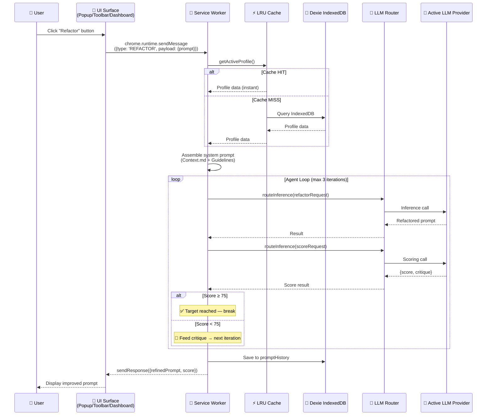

### Token-Enforced Context Pruning

The Cache Manager enforces an absolute **4000-token limit** on `Context.md` using `gpt-tokenizer` to prevent context-window overflow during API requests.

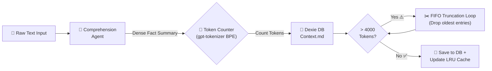

---

## 🛡️ Security & Privacy

### PII Scrubbing Pipeline

Before any data reaches an external API (Groq), a local regex pipeline scrubs sensitive patterns:

| Pattern | Regex | Example |
|---------|-------|---------|
| **API Keys** | `sk-[a-zA-Z0-9]{20,}` | `sk-abc123...` → `[REDACTED_API_KEY]` |
| **GitHub Tokens** | `ghp_[a-zA-Z0-9]{36}` | `ghp_xxx...` → `[REDACTED_TOKEN]` |
| **Emails** | Standard email regex | `user@example.com` → `[REDACTED_EMAIL]` |
| **IPv4/IPv6** | IP address patterns | `192.168.1.1` → `[REDACTED_IP]` |
| **AWS Keys** | `AKIA[0-9A-Z]{16}` | `AKIA...` → `[REDACTED_AWS_KEY]` |

### Content Security Policy

```json
{
  "content_security_policy": {
    "extension_pages": "script-src 'self' 'wasm-unsafe-eval'; object-src 'self';"
  }
}
```

> `wasm-unsafe-eval` is required for WebLLM's WASM-based GPU shader compilation. This is narrower than full `unsafe-eval` and does not open arbitrary code execution.

---

## 🛠️ Tech Stack

| Layer | Technology | Purpose |
|-------|-----------|---------|
| **Framework** | [WXT](https://wxt.dev/) v0.20 | MV3 extension framework with file-based routing |
| **UI** | [React](https://react.dev/) 19 | Component-based UI across all 3 surfaces |
| **Language** | [TypeScript](https://www.typescriptlang.org/) 5.9 | Type safety across the entire codebase |
| **Styling** | [Tailwind CSS](https://tailwindcss.com/) 3.4 | Utility-first CSS with custom design tokens |
| **Local AI** | [@mlc-ai/web-llm](https://webllm.mlc.ai/) | WebGPU-based LLM inference in the browser |
| **Storage** | [Dexie.js](https://dexie.org/) 4.x | Type-safe IndexedDB wrapper with migrations |
| **Caching** | Custom LRU Map | O(1) in-memory cache with write-through |
| **Tokenizer** | [gpt-tokenizer](https://www.npmjs.com/package/gpt-tokenizer) | BPE token counting (8KB, pure JS) |
| **Charts** | [Recharts](https://recharts.org/) | Analytics dashboard visualizations |
| **Web Parsing** | [@mozilla/readability](https://github.com/mozilla/readability) | Webpage content extraction (used by Firefox Reader View) |
| **Bundler** | [Vite](https://vitejs.dev/) (via WXT) | Lightning-fast builds with HMR |

---

## 🎭 Built-in Profiles

Each profile includes 4 markdown files that shape how the AI agents behave:

| Profile | Icon | Specialty | Scoring Focus |
|---------|------|-----------|---------------|
| **All-Rounder** | 🌐 | General-purpose prompt engineering | Intent clarity, constraints, context |
| **Developer** | 💻 | Code generation, reviews, technical docs | Technical specificity, edge cases, testability |
| **Finance** | 📊 | Financial analysis, modeling, compliance | Data precision, regulatory awareness, risk |
| **Study** | 📚 | Educational content, exam prep | Audience clarity, pedagogical structure |
| **Competitive Coder** | 🏆 | Algorithms, DSA, competitive programming | Complexity constraints, edge cases, I/O samples |
| **Creativity** | 🎨 | Creative writing, brainstorming, storytelling | Tone definition, creative space, format clarity |

### Profile 4-File System

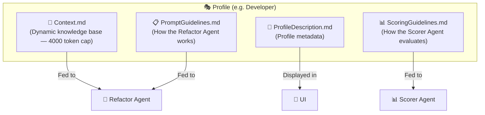

---

## 📌 Built-in Snippets

Type these triggers in any textarea to instantly inject prompt templates:

| Trigger | Description | Body Preview |
|---------|-------------|-------------|
| `/dev` | Senior TypeScript dev persona | *"You are a senior TypeScript developer with 10+ years..."* |
| `/json` | JSON output format | *"Output your response as valid JSON only..."* |
| `/step` | Step-by-step reasoning | *"Think step-by-step. Break down the problem..."* |
| `/crit` | Critical analysis | *"Analyze critically from multiple perspectives..."* |
| `/short` | Concise output | *"Be extremely concise. Maximum 3 sentences..."* |
| `/expert` | Domain expert persona | *"You are a world-class expert in this domain..."* |

---

## 🏗️ Technical Decisions

Key architectural decisions and their rationale:

| Decision | Choice | Why |
|----------|--------|-----|
| **Build Framework** | WXT (not CRXJS) | Stable MV3 support, native Shadow DOM, Nuxt-like file routing |
| **WebGPU Host** | Offscreen Document API | Only way to maintain persistent GPU context in MV3 |
| **Storage** | Dexie.js + LRU Cache | `localStorage` disabled in MV3 SW; `chrome.storage` too slow for UI |
| **Agentic Logic** | Vanilla TS (no LangChain) | Avoids 500KB+ of polyfills; agents are ~50 lines each |
| **CSS Isolation** | Shadow DOM | Prevents CSS conflicts with ChatGPT, Claude, etc. |
| **Token Counting** | gpt-tokenizer | Pure JS BPE, 8KB, works in all extension contexts |
| **PII Scrubbing** | Regex pipeline | Lightweight, no dependencies, runs before cloud API calls |
| **Keep-Alive** | Bidirectional ping + Chrome Alarms | Defeats MV3's 30-second SW termination |
| **Default Provider** | WebGPU (not Groq) | Local-first philosophy; works without API keys on fresh install |

> 📖 For the full technical deep-dive, see [TECHNICAL_DECISIONS.md](./Docs/TECHNICAL_DECISIONS.md)

---

## 👥 Contributors

Co-developed by:

<table>
  <tr>
    <td align="center"><b>arhamxfarooqui</b></td>
    <td align="center"><b>Md Anas Ali Usmani</b></td>
    <td align="center"><b>Mohd Taha Rafi</b></td>
  </tr>
</table>

---

## 📄 License

This project is licensed under the **MIT License** — see the [LICENSE](./LICENSE) file for details.

---

<div align="center">

**Built with ⚡ by the Pro Prompt team**

*Turning weak prompts into production-grade instructions — locally, privately, autonomously.*

</div>